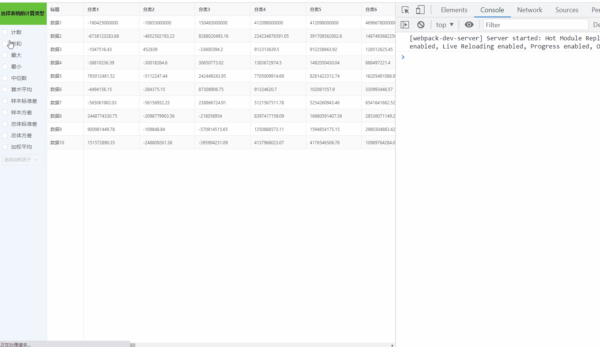

# webWorker demo

## Project setup

```
pnpm install
```

### Compiles and hot-reloads for development

```
pnpm run serve
```

### 演示示例



### 文章地址

[一文彻底了解 Web Worker，十万条数据都是弟弟](https://github.com/xy-sea/blog/blob/dev/markdown/%E4%B8%80%E6%96%87%E5%BD%BB%E5%BA%95%E4%BA%86%E8%A7%A3Web%20Worker%EF%BC%8C%E5%8D%81%E4%B8%87%E6%9D%A1%E6%95%B0%E6%8D%AE%E9%83%BD%E6%98%AF%E5%BC%9F%E5%BC%9F.md)
